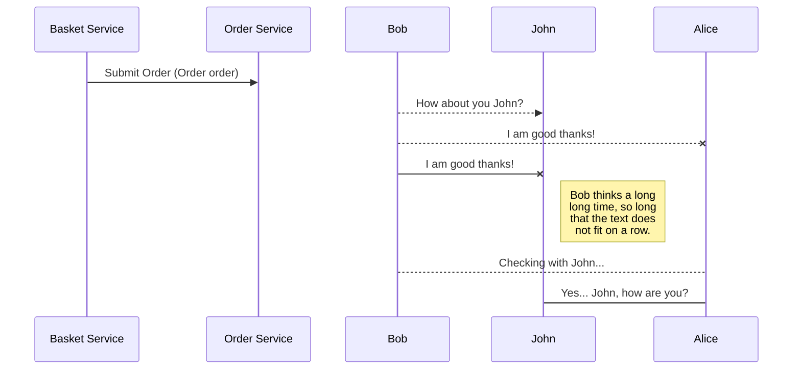

# Event Driven Architecture Examples

This repository contains some examples of **Event Driven Architecture (EDA)** using technologies such as Apache Kafka and AWS EventBrigde.

These projects were developed considering Event Collaboration and other patterns.

The following image represents the concept of Event Collaboration. 


## Projects

You can see all projects available on this repository

|  Project| Description  |
|--|--|
| Basket Service | |
| Order Service |  |
| Fraud Service |  |
| Inventory Service |  |
| Payment Service |  |
| Shipping Service |  |

### References 
See [Confluent Developer](https://developer.confluent.io/patterns/compositional-patterns/event-collaboration) detailed explanation of Event Collaboration.

## UML diagrams

You can render UML diagrams using [Mermaid](https://mermaidjs.github.io/). For example, this will produce a sequence diagram:


```
